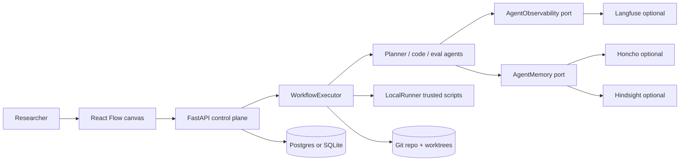

# AutoResearch High-Level Design

- **Status:** Current architecture (shipped MVP)
- **Version:** 0.5
- **Last updated:** 2026-09-11

This document describes the **running system**. Deferred / target platform ideas
are listed in §14 so they are not confused with what exists today.

## 1. Purpose

AutoResearch is a local, Git-native control plane for executable research
workflows. Operators edit a **locked research recipe** on a React Flow canvas;
the FastAPI backend compiles that recipe, runs agents and trusted scripts in
Git worktrees, gates metrics, and promotes accepted trials onto the champion
branch (`master` by default).

Git is authoritative for source, branches, notes, tags, and promotion history.
PostgreSQL (preferred) or SQLite holds the queryable control-plane projection
(projects, workflows, runs, hypotheses, trials, chat handoff). Agent vendors
(observability, memory) are optional soft-fail ports and are **never** the
research ledger.

## 2. Goals (MVP)

- Locked visual recipe for the closed research loop (compile-validated).
- Hypothesis → execution → eval script → evaluation agent → metric gate → Git decision.
- Inner self-heal retries under a hypothesis; outer feedback from decision → next hypothesis.
- Protected evaluators; promote only when the metric gate accepts.
- Durable Git lineage (hypothesis/trial branches, notes, decision tags).
- Project registry + handoff UI backed by SQL.
- Replaceable LLM agents (Cursor SDK / OpenAI), observability, and memory adapters.

## 3. Non-goals (MVP)

- Temporal / distributed workers / multi-host GPU scheduling.
- Hermes / AutoResearchClaw as the agent runtime.
- MCP tool nodes, Podman isolation, untrusted script execution.
- Collaborative real-time canvas editing.
- Content-addressed artifact object store.
- Treating vendor memory (Honcho / Hindsight / …) as authoritative research state.

## 4. System context (shipped)



Interactive diagram: [architecture.html](architecture.html).

## 5. Component design

### 5.1 Web application

**Technology:** React, TypeScript, Vite, React Flow.

Responsibilities:

- **Locked research recipe** canvas (not a freeform node palette): exactly one of
  each required spine type, optional `database` viewer, typed ports per role.
- Side panel documents the locked grammar; required nodes cannot be deleted;
  illegal connections/reconnects are blocked with notices.
- Save and Run are gated on `compileRecipe` (mirrors backend `compile_recipe`).
- **Reset recipe layout** restores the starter graph; toolbar **DB** opens the
  project explorer.
- Live run status, pause/cancel/resume, staircase metrics, slide-overs
  (agent / evaluation / DB).
- Project picker, New Project, **Restart** (wipe experiment ledger + start fresh).
- Workflow JSON saved via API (SQL `workflows.definition`).

### 5.2 Control plane

**Technology:** FastAPI, Pydantic, SQLAlchemy. Schema bootstrap via
`Base.metadata.create_all` (no Alembic in MVP).

Responsibilities:

- CRUD workflows; **`compile_recipe` validation** on save, create-run, and
  project restart (HTTP **422** if the graph is not a legal research recipe).
- Start runs as in-process `BackgroundTasks`.
- Cancel / pause / resume via `run_control`.
- Projects: create (optional GitHub via `gh`), activate, handoff, table explorer.
- `POST /api/projects/{id}/restart` — skill-aligned wipe + auto-start.
- Serve hypotheses, trials, evaluations, trial diffs.

Runs execute inside the API process through `WorkflowExecutor` + `LocalRunner`.
There is no separate Temporal worker or Git→SQL projector process.

### 5.3 Execution model

**Technology:** Git worktrees, trusted local subprocesses, wall-clock timeouts.

- Executor always runs a **`CompiledLoop`** from `compile_recipe` (no free
  topological fallback). Outer loop uses `max_hypotheses`; inner retries use
  `max_retries`; post-trial order is fixed:
  `eval_script → evaluation → metric_gate → git_decision`.
- Each trial gets `trial/H####/T###` branched from its hypothesis branch
  (sibling-style; configurable ancestry policies are not implemented).
- Scripts run only in the trial worktree with captured stdout/stderr.
- Allow-lists come from `execution.config.allowed_paths` (legacy `script`
  annotation is fallback only).
- Protected paths (e.g. `eval.py`) cannot be modified by candidates.
- Champion promotion: clean worktree on champion branch, base must still match
  hypothesis base commit, then `merge --no-ff`. Dirty champion fails with
  porcelain paths; accepted note/tag is written only after a successful merge.

### 5.4 Research agents

Replaceable Cursor SDK / OpenAI agents (not Hermes):

| Role | Module | Toggle |
|------|--------|--------|
| Hypothesis planner | `hypothesis_planner.py` | `use_planner` on hypothesis node |
| Code / execution edits | `code_agent.py` | `use_agent` on execution node |
| Evaluation judgment | `evaluation_agent.py` | `use_agent` on evaluation node |

Without planners/agents, briefs and template judgments still drive a deterministic
loop. Agents consume SQL history + briefs; optional memory injects soft lessons.

### 5.5 Git ledger

Authoritative for code and research evidence. Notes refs in use:

```text
refs/notes/research/hypotheses
refs/notes/research/evaluations
refs/notes/research/decisions
refs/notes/research/champions
```

Decision tags (examples):

```text
accepted/H0001-T001
rejected/H0001-T001
failed/H0001-T001
```

Rejected/failed trials keep their branches and records. Champion branch default
is `master` (`AUTORESEARCH_CHAMPION_BRANCH`).

### 5.6 SQL control plane (preferred Postgres)

Tables (ORM, default `public` schema, scoped by `project_id` where relevant):

`projects`, `workflows`, `runs`, `node_runs`, `metrics`, `hypotheses`, `trials`,
`chat_messages`, `chat_summaries`.

On project create, Postgres also `CREATE SCHEMA IF NOT EXISTS "proj_<slug>"`
(reserved namespace; rows remain in `public` today).

SQLite is for tests / zero-setup smoke when `AUTORESEARCH_DATABASE_URL` is unset.

### 5.7 Agent observability (optional)

Port: `backend/src/autoresearch_api/observability/`.

| Backend | Meaning |
|---------|---------|
| `noop` | Default off |
| `langfuse-cloud` | Langfuse Cloud |
| `langfuse-selfhost` | Local OSS (`make langfuse-selfhost-up`, UI `:3000`, DB host **5434**) |
| `langfuse` | Generic host + keys |

Agents never import `langfuse`. Evaluation notes store vendor-neutral
`agent_trace_id` / `prompt_version` / `observability_backend`. Real token usage
is passed through when providers report it; no invented costs.

### 5.8 Agent memory (optional)

Port: `backend/src/autoresearch_api/memory/`.

| Backend | Meaning |
|---------|---------|
| `noop` | Default off |
| `honcho` | Preferences / session memory (`honcho-ai` extra) |
| `hindsight` | Retain/recall bank (install vendor client separately) |
| `composite` | Fan-out retain; merge/dedupe recall (`MEMORY_PROVIDERS=honcho,hindsight`) |

Briefs inject an advisory Memory section on recall. Outcomes and chat handoff
call retain. Memory is never SoR for champion, gates, or trial branches.

## 6. Workflow model (MVP)

The canvas is a **constrained research recipe**, not a general-purpose DAG.
Frontend [`frontend/src/recipe.ts`](../frontend/src/recipe.ts) and backend
[`backend/src/autoresearch_api/workflow.py`](../backend/src/autoresearch_api/workflow.py)
share the same grammar and compile to a `CompiledLoop`.

```text
Hypothesis → Execution ⇄ (self-heal)
           → Eval script → Evaluation agent
           → Metric gate → Git decision → Hypothesis
```

### Required types (exactly one each)

`hypothesis`, `execution`, `eval_script`, `evaluation`, `metric_gate`, `git_decision`

### Legal directed edges

| Source | Target | Role |
|--------|--------|------|
| hypothesis | execution | start trial work |
| execution | eval_script | metrics path (required in practice) |
| execution | evaluation | optional direct edge |
| eval_script | evaluation | feed metrics into judgment |
| evaluation | metric_gate | gate input |
| metric_gate | git_decision | promote/reject |
| execution | hypothesis | self-heal retry |
| git_decision | hypothesis | outer feedback |

Required edges include hyp→exec, eval_script→evaluation, evaluation→gate,
gate→decision, and at least one execution→eval path. Post-trial spine must be
`eval_script → evaluation → metric_gate → git_decision`.

### Other node roles

| Node | Role |
|------|------|
| `database` | UI viewer only (no ports / not in compile spine) |
| `trial` | Viewer type (not a palette recipe role) |
| `script` | Legacy allow-list annotation only; prefer `execution.allowed_paths` |

Contracts live under `contracts/`. Workflow JSON is stored in SQL
`workflows.definition`. Invalid recipes are rejected with HTTP 422 on save,
run, and restart.

## 7. Branching and promotion (MVP)

```text
master   (champion)
└── hypothesis/H0001-…
    └── trial/H0001/T001
        └── trial/H0001/T002   (retry under same hypothesis)
```

Promotion (accepted gate):

1. Require champion worktree clean and HEAD == hypothesis base.
2. `git merge --no-ff trial/…`.
3. Record decision note + `accepted/…` tag + champions note.
4. Next hypothesis bases on the new champion tip.

If the champion advanced underfoot, merge fails with “champion advanced”
(no automatic rebase/re-eval queue yet).

## 8. Evaluation integrity

- Eval scripts and protected paths are not writable by candidates.
- Eval stdout must be a single JSON object with numeric `metrics` (any number of
  named metrics may be emitted for logging / agent judgment).
- **Default metric gate is scalar:** exactly one configured `metric` +
  `direction` (`minimize` | `maximize`) + `min_delta`, compared to the live
  champion baseline for that metric when available. This matches
  `contracts/evaluation.schema.json` (`primary_metric`, `direction`) and the
  example gate in `examples/basic-research/research-loop.json`.
- **Opt-in Pareto policy:** set `policy: "pareto"` with `objectives[]`
  (`metric`, `direction`, `epsilon`) and optional `hard_gates[]`. Candidates
  that pass hard gates and are not ε-dominated are **kept** on a frontier
  (Git notes/tags + SQL); they are **not** auto-merged to `master`. Humans
  select the next hypothesis base via `POST /api/projects/{id}/frontier/select`
  (optional `promote: true` merges onto the champion). See
  `contracts/frontier.schema.json` and `examples/pareto-research/`.
- Threshold bands with tolerances and statistical-significance policies remain
  deferred.
- Malformed eval / scalar gate failure never merges; Pareto DISCARD never merges.

## 9. Failure handling

| Failure | Behavior |
|---------|----------|
| Script non-zero | Trial failed; retry up to `max_retries` |
| Agent invalid output | Soft-fail / retry per agent; run can fail |
| Dirty champion on accept | Decision fails; porcelain paths in error; no accepted ledger without merge |
| API restart mid-run | Worker dies; mark run failed / use Restart |
| Project Restart | Wipe experiment refs + SQL ledger; keep champion tip; start new run |

## 10. Security boundaries (MVP)

- Trusted local scripts only; not a security sandbox.
- Per-trial worktree + timeout + cancel kills process group.
- Secrets via process env (`CURSOR_API_KEY`, `OPENAI_API_KEY`, Langfuse/Honcho keys);
  never commit `backend/.env`.
- Protect champion branch and evaluator paths.

## 11. Deployment (local MVP)

```text
frontend (:5173)     Vite React canvas
backend  (:8000)     FastAPI + in-process executor
postgres (:5432)     optional SoR  — make postgres-up
langfuse (:3000)     optional OSS  — make langfuse-selfhost-up
                     (Langfuse Postgres on host :5434)
```

## 12. Observability and memory summary

- **Scientific metrics / staircases:** AutoResearch UI + Git champions notes.
- **LLM traces / usage:** Langfuse via `AgentObservability` (optional).
- **Prefs / soft lessons:** Honcho / Hindsight via `AgentMemory` (optional).

## 13. Key decisions

| Decision | Rationale |
|----------|-----------|
| Constrained recipe grammar + compile-time validation | Keep the research loop unambiguous across UI, API, and executor |
| Git canonical for code lineage | Reviewable branches, notes, tags |
| SQL for control plane + handoff | Fast UI queries; not a second champion |
| In-process executor first | Prove the loop before Temporal |
| Cursor/OpenAI agents behind modules | Swap runtime later (Hermes deferred) |
| Observability + memory as ports | Soft-fail vendors; keep SoR clear |
| Champion branch `master` | Matches benches and git_service default |
| Restart keeps champion tip | Wipe experiments without losing accepted code |

## 14. Deferred / target platform

Not shipped; do not treat as current architecture:

- Freeform / general-purpose DAG editors (arbitrary node graphs).
- Temporal durable orchestration and parallel trial scheduling.
- Hermes / AutoResearchClaw as primary agent.
- MCP tool nodes; Podman untrusted isolation.
- Rebase → re-eval → merge queue when champion advances.
- Auto-pick utility / crowding over Pareto frontiers; tolerance-band /
  statistical gate policies (ε-Pareto KEEP/DISCARD is shipped as opt-in
  `policy: "pareto"` beside the default scalar gate).
- Content-addressed artifacts; Forgejo multi-user hosting.
- OpenTelemetry / Prometheus service metrics stack.
- Configurable trial ancestry (`sibling` / `chained` / `last_runnable`).

See also [MVP_SCOPE.md](MVP_SCOPE.md) and the root [README](../README.md).
