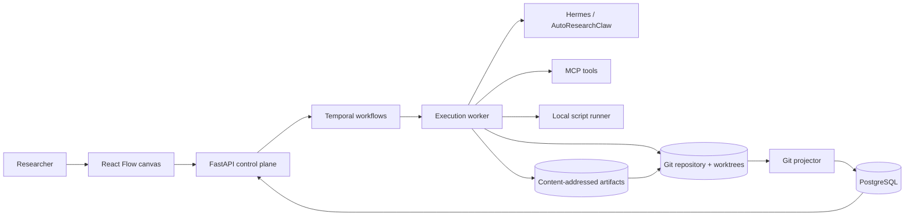

# AutoResearch High-Level Design

- **Status:** Draft
- **Version:** 0.2
- **Last updated:** 2026-09-03

## 1. Purpose

AutoResearch is a visual, Git-native system for autonomous experimentation. Users arrange executable nodes on a whiteboard and connect typed ports to define how hypotheses, code changes, artifacts, and metrics move through a research loop.

The system preserves a complete audit trail while continuously accumulating only verified improvements on the champion branch.

## 2. Goals

- Provide a drag-and-drop whiteboard for composing research workflows.
- Execute Python, shell, evaluator, agent, MCP, control-flow, and Git nodes.
- Represent each new idea as a hypothesis branch from the latest `main`.
- Represent each attempt or repair as a configurable trial branch derived from its hypothesis lineage.
- Evaluate candidates with repository-controlled scripts and structured metrics.
- Merge a candidate only when it improves on the current champion under a configured policy.
- Record research lineage, evidence, and decisions in Git.
- Use PostgreSQL for responsive queries without making it the canonical ledger.
- Recover safely from process crashes and support parallel trials.
- Keep agents, model providers, evaluators, and execution backends replaceable.

## 3. Non-goals for the first milestone

- A general-purpose CI/CD platform.
- Distributed GPU scheduling across multiple clusters.
- A public workflow marketplace.
- Collaborative real-time canvas editing.
- Storing large datasets and model checkpoints in normal Git objects.
- Treating an agent's private memory files as authoritative research state.

## 4. System context

The architecture diagram is available as a standalone artifact at [architecture.html](architecture.html).



## 5. Component design

### 5.1 Web application

**Technology:** React, TypeScript, Vite, React Flow, Tailwind CSS, shadcn/ui, Monaco Editor, Apache ECharts.

Responsibilities:

- Render an infinite whiteboard with movable nodes and directed edges.
- Provide a searchable node palette and node configuration inspector.
- Validate port compatibility before creating an edge.
- Display live execution status, logs, artifacts, metrics, diffs, and decisions.
- Compare trials against their baseline and current champion.
- Submit immutable workflow versions for execution.

Canvas coordinates are UI metadata. Executable workflow definitions are versioned as JSON in `.research/workflows/`.

### 5.2 Control plane

**Technology:** FastAPI, Pydantic, SQLAlchemy, Alembic.

Responsibilities:

- Validate workflow definitions and node configurations.
- Resolve repository state and enforce naming conventions.
- Start, cancel, and inspect workflow executions.
- Serve projected history and metrics from PostgreSQL.
- Stream logs and state changes to the browser.
- Enforce authorization and policy boundaries.

The control plane invokes Git through a small audited adapter around the native Git CLI. It never infers canonical decisions from SQL alone.

### 5.3 Durable orchestrator

**Technology:** Self-hosted Temporal and the Temporal Python SDK.

Responsibilities:

- Execute the compiled DAG durably.
- Schedule ready nodes after their dependencies complete.
- Support retries, timeouts, cancellation, conditions, and bounded loops.
- Resume safely following worker or host failures.
- Coordinate parallel trials and the serialized merge queue.

Temporal history is operational state. Terminal research results must be written to Git before an execution is considered complete.

### 5.4 Execution workers

**MVP technology:** Python worker, Git worktrees, and per-project Python virtual environments.

Responsibilities:

- Allocate an isolated worktree for each active hypothesis or trial.
- Materialize declared inputs and environment configuration.
- Execute trusted scripts as local subprocesses inside their assigned worktrees and virtual environments.
- Capture stdout, stderr, exit code, duration, resource usage, and artifacts.
- Validate evaluator output against its declared JSON Schema.
- Commit code changes and append structured Git records.

The MVP runner is intentionally simple and is suitable only for trusted scripts. It enforces working-directory boundaries, explicit environment variables, output capture, and wall-clock timeouts, but it is not a security sandbox.

Rootless Podman becomes the execution boundary in the hardening milestone, before the platform permits untrusted scripts or unattended autonomous execution. At that point network access, mounts, CPU, memory, process count, disk, GPU, and wall-clock limits become explicit node policy.

### 5.5 Research agent

**Initial implementation:** Hermes Agent with AutoResearchClaw research behavior.

Responsibilities:

- Propose a hypothesis from the current champion, past evidence, and user objective.
- Produce a structured experiment plan.
- Modify code only inside the assigned worktree.
- Diagnose failed trials and propose repair trials.
- Return schema-constrained outputs rather than implicit Markdown state.

Hermes is a replaceable reasoning component. The platform supplies context derived from Git and PostgreSQL; Hermes memory is not the research ledger.

Optional agent observability (default off) uses a vendor-agnostic `AgentObservability` port. Users select `noop`, `langfuse-cloud`, or `langfuse-selfhost` (local OSS via `ops/langfuse`). The Langfuse adapter stores full agent prompts/generations and heuristic scores; Git evaluation notes carry opaque `agent_trace_id` values so the vendor remains swappable. Scientific explainability (metrics, gates, decisions) stays in Git.

### 5.6 Git ledger

Git is authoritative for source code, workflow definitions, ancestry, agent patches, evaluation policy, evaluator version, fingerprints, metrics, decisions, champion merges, and artifact manifests.

Structured records are stored as versioned JSON using dedicated Git notes refs:

```text
refs/notes/research/hypotheses
refs/notes/research/evaluations
refs/notes/research/decisions
refs/notes/research/artifacts
```

Terminal states also receive durable tags:

```text
accepted/H0001/T003
rejected/H0001/T001
failed/H0001/T002
```

Notes and tags are pushed with code refs. Record schemas live under `.research/schemas/`.

### 5.7 PostgreSQL projection

PostgreSQL provides indexed read models for the UI and scheduler. Initial tables are `repositories`, `workflow_versions`, `workflow_nodes`, `workflow_edges`, `hypotheses`, `trials`, `node_runs`, `metrics`, `artifacts`, `decisions`, `git_refs`, and `merge_queue`.

A projector reads branches, commits, notes, and tags and performs idempotent upserts. The database can be deleted and rebuilt from the Git ledger; ephemeral logs and scheduler leases may remain SQL-only.

### 5.8 Artifact storage

Large artifacts are stored outside normal Git objects in a content-addressed local store for the first milestone. Git stores a manifest containing the SHA-256 digest, media type, size, producer node and trial, producer commit, storage URI, and creation time.

Forgejo Git LFS or a compatible open-source object store can replace local storage later without changing this contract.

### 5.9 MCP integration

MCP is an interoperability boundary, not the orchestration engine.

- An MCP Tool node invokes a selected server tool with schema-validated inputs.
- A completed workflow may optionally be exposed as an MCP tool.
- MCP calls use explicit allowlists, timeouts, and redacted logging.
- Credentials are injected by the runtime and never committed to Git or node definitions.

## 6. Workflow and type model

A workflow is a directed graph of immutable node definitions and edges. Each port declares a JSON Schema. An edge is valid only when its output contract is assignable to the destination input contract.

| Family | Nodes |
|---|---|
| Research | Agent, Create Hypothesis, Create Trial |
| Execution | Python Script, Shell Script, Container Command |
| Evaluation | Evaluation Script, Metric Gate, Compare Champion |
| Control flow | Condition, Fan-out, Join, Loop, Retry, Human Approval |
| Integration | MCP Tool, Artifact Input/Output |
| Git | Commit, Tag Decision, Rebase, Merge Champion |

Loops declare a maximum iteration count, maximum cost or runtime, and a terminal condition.

## 7. Git branching and trial policies

```text
main
└── hypothesis/H0001-description
    ├── trial/H0001/T001
    ├── trial/H0001/T002
    └── trial/H0001/T003
```

Every hypothesis starts from the latest accepted `main`. Trial ancestry is configurable:

- `sibling`: every trial starts from the hypothesis root.
- `chained`: the next trial starts from the previous trial, including its fixes.
- `last_runnable`: the next trial starts from the latest trial that executed successfully.

The default is `sibling` because it isolates causal effects. Repair-oriented workflows may choose `chained` or `last_runnable`.

### Promotion protocol

1. Lock the candidate and evaluator commits.
2. Record dataset checksum and environment fingerprint.
3. Run the evaluator and validate its structured metrics.
4. Compare the candidate with its declared baseline using the promotion policy.
5. If rejected, record the evidence and create a rejected tag.
6. If provisionally accepted, enqueue the candidate for serialized promotion.
7. Rebase onto the latest `main` if `main` advanced.
8. Rerun evaluation against the new champion.
9. Merge with `--no-ff` only if the candidate still passes.
10. Record the final decision and update the PostgreSQL projection.

Re-evaluation after rebasing prevents promotion based on an obsolete baseline.

## 8. Evaluation integrity

- Evaluation scripts and policies live in protected repository paths.
- Candidate permissions prevent modifications to protected evaluation assets.
- Results record evaluator commit, candidate commit, parameters, seeds, dataset digest, environment fingerprint, and raw metric output digest.
- Policies support maximize, minimize, thresholds, tolerances, and multi-metric constraints.
- Non-deterministic evaluations may require repeated runs and statistical confidence.
- A failed or malformed evaluator never counts as an improvement.

## 9. Failure handling

| Failure | Behavior |
|---|---|
| Script exits non-zero | Record failure; apply configured retry or repair policy |
| Worker crashes | Temporal reschedules the activity subject to policy |
| Agent returns invalid data | Retry with schema validation feedback |
| Evaluator output is malformed | Mark trial invalid; never promote |
| `main` advances before merge | Rebase and rerun evaluation |
| Merge conflict | Block candidate; invoke repair or human approval policy |
| PostgreSQL is lost | Rebuild it from Git refs, notes, tags, and commits |
| Artifact is corrupt | Detect digest mismatch and mark evidence incomplete |

## 10. Security boundaries

For the trusted-script MVP:

- Run each trial in its own Git worktree and project virtual environment.
- Pass an explicit environment allowlist rather than inheriting the full host environment.
- Apply wall-clock timeouts and terminate child process groups on cancellation.
- Do not execute third-party or otherwise untrusted scripts.
- Keep model, Git, and MCP credentials out of script environments unless explicitly required.
- Redact secrets from logs before persistence.
- Protect `main`, evaluator paths, and research note refs.

Future Podman hardening adds:

- Rootless containers for every trial.
- No network access and read-only base filesystems by default.
- Mounts limited to the assigned worktree and declared artifact paths.
- CPU, memory, process, disk, GPU, and wall-clock limits.
- Disposable environments and image-based dependency reproducibility.

## 11. Deployment model

The MVP is a single-machine development deployment with ordinary local processes:

```text
web
api
worker
projector
postgres
hermes
artifact-volume
```

The MVP worker executes one workflow sequentially. Services may be launched directly during development. Temporal is added in Milestone 4, and Podman Compose becomes a packaging option only after container isolation is introduced.

Later, workers can move to separate GPU hosts while retaining the same API and Git contracts.

## 12. Observability

- Structured logs with workflow, hypothesis, trial, node, and commit identifiers.
- OpenTelemetry traces across API, workflow, worker, agent, MCP, and evaluator calls.
- Prometheus-compatible service metrics.
- User timelines reconstructed from Git evidence plus live operational state.
- Metric charts backed by PostgreSQL and linked to canonical Git records.

## 13. Delivery plan

### Milestone 1: Git lifecycle vertical slice

- Establish `main` as the protected champion branch.
- Define versioned schemas for workflows, hypotheses, evaluations, and decisions.
- Implement branch, worktree, notes, tags, and promotion operations.
- Execute trusted local scripts and evaluators sequentially in worktrees and virtual environments.
- Project the resulting Git state into PostgreSQL.

### Milestone 2: Executable canvas

- Build the React Flow editor and node inspector.
- Add typed ports and connection validation.
- Add Script, Eval, Metric Gate, Git Decision, and Merge nodes.
- Display live runs, Git diffs, and metric comparisons.

### Milestone 3: Closed-loop agent

- Integrate Hermes and AutoResearchClaw through structured contracts.
- Add hypothesis generation and repair-trial policies.
- Add MCP Tool nodes, budgets, and terminal conditions.

### Milestone 4: Durable parallel execution

- Adopt Temporal for recovery, retries, cancellation, and parallel trials.
- Add serialized rebase/re-evaluate/merge promotion.

### Milestone 5: Execution hardening

- Add rootless Podman isolation and resource policies.
- Disable network access by default and allow only declared mounts.
- Introduce versioned execution images and reproducible dependency environments.
- Permit untrusted or unattended autonomous script execution only after isolation tests pass.

### Milestone 6: Collaboration and scale

- Deploy Forgejo and protect relevant refs and paths.
- Add authentication, authorization, remote workers, GPU scheduling, and shared artifact storage.

## 14. Key decisions

| Decision | Rationale |
|---|---|
| Build the editor with React Flow | It directly supports whiteboard interaction and custom executable nodes. |
| Keep Git canonical | Branches and commits make code lineage reproducible and reviewable. |
| Make PostgreSQL rebuildable | The UI needs fast queries without creating a second source of truth. |
| Use native Git worktrees | Trials can run concurrently without duplicating repositories. |
| Keep Hermes outside the control plane | Agents remain replaceable and cannot redefine platform state. |
| Re-evaluate after rebase | Promotion is always measured against the latest champion. |
| Keep large artifacts outside normal Git | Avoid repository bloat while retaining cryptographic provenance. |
| Delay Temporal until the vertical slice works | Validate Git semantics before adding distributed complexity. |
| Delay Podman until execution hardening | Keep the MVP simple while making the trust boundary explicit. |

## 15. Open questions

- Which metric aggregation and statistical significance policies are required first?
- Should rejected trial branches be retained indefinitely, archived, or deleted after tagging?
- Which artifact backend should follow the local content-addressed store?
- Which model providers and local inference runtimes must Hermes support initially?
- Is human approval required for all champion merges or only configured risk classes?
- What resource budget should terminate an autonomous research loop?
